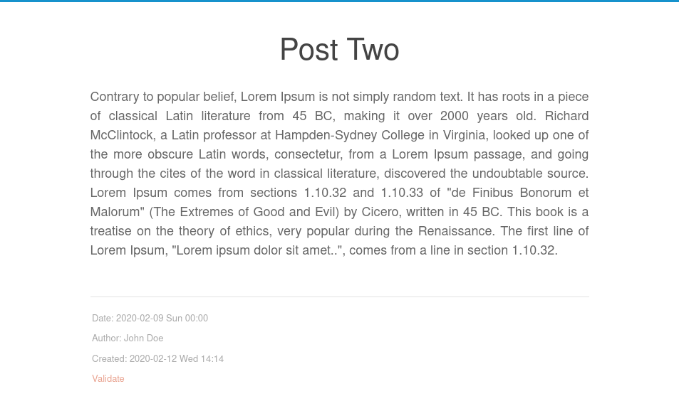

# Blogging using Emacs & Org mode

I started blogging using WordPress, used it for few years but at the same time I
was looking for something to publish entirely using [GNU
Emacs](https://www.gnu.org/software/emacs/). I switched to
[Org2Blog](https://github.com/org2blog/org2blog) and was quite happy to blog
from the Org mode. Still something was missing, something felt unsatisfying. I
even tried to create a website using [Django](https://www.djangoproject.com/) to
publish Emacs configs which I named
[haqiba](https://github.com/psachin/haqiba)(pretty unusual name I know) but soon
switched to Jekyll. Jekyll is cool and provides more control over the content
and publishing, but blogging directly from Emacs or [Org
mode](https://orgmode.org/) was still missing. Although
[jekyll-org](https://github.com/eggcaker/jekyll-org) can be used to add Org mode
support to Jekyll but all those frameworks sounded alienated until I came across
[org-publish](https://orgmode.org/manual/Publishing.html). I stumbled upon
**org-publish** few times before but found it too complex for blogging.
Eventually I gave it a try and since then I loved it.

There are a bunch of existing websites published using **org-publish**. [This
page](https://pages.gitlab.io/org-mode/post3.html) maintains a list and I'm sure
there are more which are not covered here. Take a look at Bernt Hansen's [Org
Mode - Organize Your Life In Plain Text!](http://doc.norang.ca/org-mode.html)
for more exclusive understanding and usage of the Org mode where he uses
**org-publish** for publishing the content.

Before we move to creating a basic setup for publishing Org files, I'd like to
mention few advantages of using **org-publish**:

- Good control of configurations, CSS, media, and publishing.
- Supports [Org mode formatting](https://orgmode.org/guide/).
- Static files generation.
- Easy deployment using
  [GitLab](https://pages.gitlab.io/org-mode/post2.html)/GitHub's CI/CD. More on
  this later.
- If you prefer copying files to the remote server instead of using
  GitLab/GitHub pages, hosting via Apache/Nginx/file-server is easy.
- Everything in GNU Emacs. Yey!
- Version controlled.

## Basic setup

The [Org-publish
tutorial](https://orgmode.org/worg/org-tutorials/org-publish-html-tutorial.html)
covers basic template to get started. I encourage you to go through the
tutorial. However, we are going to create a basic setup just to get a brief
understanding of **org-publish**. We start by configuring a variable
`org-publish-project-alist` in a `publish.el` file inside `myblog/`
directory(this is our project directory). The content of `publish.el` is as
follows:

```lisp
(require 'ox-publish)

(setq org-publish-project-alist
      '(("posts"
         :base-directory "posts/"
         :base-extension "org"
         :publishing-directory "public/"
         :recursive t
         :publishing-function org-html-publish-to-html
         :auto-sitemap t)
        ("all" :components ("posts"))))
```

The first line is an import statement. The variable `org-publish-project-alist`
will have a list of publishing projects to control publishing behavior. As you
see, the first element is the "posts" where all the configurations specific to
blogs posts are configured. For example, the property `:base-directory` will
configure the directory where all the posts(in org format) are saved. Similarly
`:publishing-directory` will configure the directory to save generated HTML
files from org files. Setting the `:recursive` property to `t` will recursively
generate HTML from all the org files present within and the sub-directories of
`posts/`. The `:auto-sitemap` property will generate `sitemap.html` with the
list of posts. We will tweak this soon. Finally we need a function to convert
all the org files to HTML, this is done by `:publishing-function
org-html-publish-to-html`. We can also define our own function but we will use
the builtin function provided by `ox-publish` at the moment.

We also need a few posts for testing, so create a file `posts/post_one.org` and
include basic headers[1] with some content. The file should look something like
below:

File: `posts/post_one.org`
```org
#+title: Post One
#+date: <2020-02-12 Wed>
#+author: John Doe
#+email: john.doe@example.com

Lorem Ipsum is simply dummy text of the printing and typesetting industry.
```

The setup is almost ready and you can use `M-x org-publish-all` to generate the
HTML but we'll use `make` to handle the publishing. Below is the content of the
`Makefile`:

```make
# Makefile for myblog

.PHONY: all publish publish_no_init

all: publish

publish: publish.el
	@echo "Publishing... with current Emacs configurations."
	emacs --batch --load publish.el --funcall org-publish-all

publish_no_init: publish.el
	@echo "Publishing... with --no-init."
	emacs --batch --no-init --load publish.el --funcall org-publish-all

clean:
	@echo "Cleaning up.."
	@rm -rvf *.elc
	@rm -rvf public
	@rm -rvf ~/.org-timestamps/*
```

Below is the current layout of the project:

```shell
myblog
├── Makefile
├── posts
│   └── post_one.org
└── publish.el
```

Executing `make` will generate `sitemap.html` & `post_one.html` in `public/` as
shown below:

```shell
myblog
├── Makefile
├── posts
│   ├── post_one.org
│   └── sitemap.org
├── public
│   ├── post_one.html
│   └── sitemap.html
└── publish.el
```


*Post One*

## Including CSS in the post

The `publish.el` can be further enhanced to include other elements like CSS or
images. Let's add a section/project for CSS. The modified `publish.el` looks
like below:

```lisp
(require 'ox-publish)

(setq org-publish-project-alist
      '(("posts"
          :base-directory "posts/"
          :base-extension "org"
          :publishing-directory "public/"
          :recursive t
          :publishing-function org-html-publish-to-html
          :auto-sitemap t)
         ("css"
          :base-directory "css/"
          :base-extension "css"
          :publishing-directory "public/css"
          :publishing-function org-publish-attachment
          :recursive t)
         ("all" :components ("posts" "css"))))
```

Create a new directory with the name `css/` and copy
[site.css](https://gitlab.com/psachin/myblog/-/raw/master/css/site.css).
Additionally we will create a new post(`posts/post_two.org`) to test the CSS.

File: `posts/post_two.org`:
```org
#+title: Post Two
#+date: <2020-02-12 Wed>
#+author: John Doe
#+email: john.doe@example.com
#+HTML_HEAD: <link rel="stylesheet" type="text/css" href="../css/site.css" />

Lorem Ipsum is simply dummy text of the printing and typesetting industry.
```

As you may have noticed, the CSS is included using the `#+HTML_HEAD:` option[2].
Below is the layout which displays the `css/` directory:

```shell
myblog
├── css
│   └── site.css
├── Makefile
├── posts
│   ├── post_one.org
│   └── post_two.org
└── publish.el
```

Eventually, the task of including `#+HTML_HEAD:` in every post will soon become
tedious. Also, there will be multiple stylesheet in a website. To address this
issue, we can use `#+SETUPFILE:` option as seen below.

File: `posts/post_two.org`:
```org
#+title: Post Two
#+date: <2020-02-12 Wed>
#+author: John Doe
#+email: john.doe@example.com
#+SETUPFILE: ../org-templates/style.org

Lorem Ipsum is simply dummy text of the printing and typesetting industry.
```

File `org-templates/style.org`, will include the path to the actual stylesheet:

```org
#+HTML_HEAD: <link rel="stylesheet" type="text/css" href="../css/site.css" />
```

Below is the final layout:

```
myblog
├── css
│   └── site.css
├── Makefile
├── org-template
│   └── style.org
├── posts
│   ├── post_one.org
│   └── post_two.org
└── publish.el
```


*Post Two*

## Tweaking the Site map

As a setup towards final configuration, we will generate an `index.html` instead
of a `sitemap.html` file. Rename the title, configure the author & email
across the website. Below is the finished `publish.el`:

```lisp
(require 'ox-publish)

(setq org-publish-project-alist
      '(("posts"
         :base-directory "posts/"
         :base-extension "org"
         :publishing-directory "public/"
         :recursive t
         :publishing-function org-html-publish-to-html
         :auto-sitemap t
         :sitemap-title "Blog Index"
         :sitemap-filename "index.org"
         :sitemap-style list
         :author "John Doe"
         :email "john.doe@example.com"
         :with-creator t)
        ("css"
         :base-directory "css/"
         :base-extension "css"
         :publishing-directory "public/css"
         :publishing-function org-publish-attachment
         :recursive t)
	    ("all" :components ("posts" "css"))))
```


*The Index or the Homepage*

If you are following this post and had difficulty setting up the project, I've
uploaded the project at https://gitlab.com/psachin/myblog for reference.

## Using an existing org-publish setup

Using **org-publish** to create blogs from scratch might be tedious, hence to
ease the adoption of **org-publish**, I've created a repository which can be
used as base template to publish your own blogs.

Clone the `blog_template` branch:

```shell
git clone https://gitlab.com/psachin/psachin.gitlab.io -b blog_template --single-branch myblog
```

Use `make` to export Org pages to HTML and as you know, the `public/` directory
will have all the files required for hosting:

```shell
cd myblog
make
```
A sample blog post exists in `posts/template.org` for reference. Use the
provided `.gitlab-ci.yaml` to publish the content of `public/` as GitLab pages.


*Homepage rendered from base blog template*


*About Page rendered from base blog template*

## Bonus Tip 1

After executing the `make` command, the `public/` directory will have all the
files necessary for hosting a static site, all you have to do is to configure
the web-server to server this directory or you can render the blog locally using
Python's builtin `http.server` module.

In Python3.6, use:

```shell
cd myblog/public
python -m http.server
```

If Python3.7 is installed, you can serve `public/` using:

```shell
cd myblog
python -m http.server --directory=public
```

Open http://localhost:8000/ in the Web browser to view the website.

## Bonus Tip 2

This is my personal favorite. When some new blog post idea pops into my mind but
at the same time I don't have time to work on it instantly, I can quickly create
a draft using [Org Capture
templates](https://orgmode.org/manual/Capture-templates.html). Below is the
template definition that will open a buffer window by typing `C-c c p`. When
finished, type `C-c C-c` to save the draft. Copy the following Elisp snippet in
you existing Emacs configuration file(make sure the change the file path):

```lisp
(defun create-blog-post ()
	"Create an org file in ~/source/myblog/posts."
	(interactive)
	(let ((name (read-string "Filename: ")))
	(expand-file-name (format "%s.org" name) "~/source/myblog/posts/")))

(setq org-capture-templates
	'(("p" "Post" plain
		(file create-blog-post)
		(file "~/.emacs.d/org-templates/post.orgcaptmpl"))))
```

Below is the content of `~/.emacs.d/org-templates/post.orgcaptmpl`:

```
#+title: %^{Name}
#+date: <%<%Y-%m-%d>>
#+keywords: draft
#+setupfile: ../org-templates/post.org

%?

#+INCLUDE: "../disquss.inc"
```

[Here](https://youtu.be/ElaL7qE9jUw) is the video demonstration of Org Capture
template.

## Footnotes
[1] Use `C-c C-e # default` and `C-c C-e # html` to include default and HTML
templates respectively.

[2] The [org-publish
    tutorial](https://orgmode.org/worg/org-tutorials/org-publish-html-tutorial.html#org376932a)
    suggest use of `#+STYLE:` option to include the stylesheet which did not
    work for me as a result I used `#+HTML_HEAD:` as suggested in [Org mode
    manual:CSS support](https://orgmode.org/manual/CSS-support.html).
